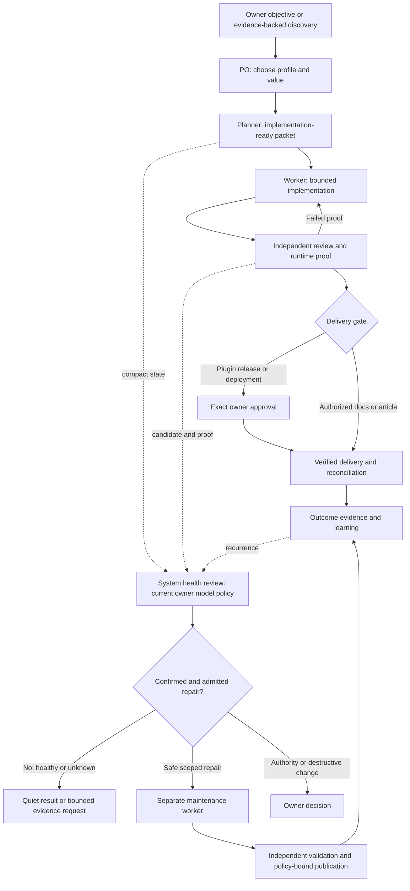

# Product Workflow Profiles

Select one profile per task; use the existing role, release, proof and quality contracts rather than parallel policy copies. PO owns progress; Planner, Worker, Review and Proof are bounded roles, not automatically five permanent scheduled tasks.

## Common Spine

Evidence/value -> duplicate-screened issue -> scoped milestone/acceptance packet -> implementation -> independent review + current proof -> delivery gate -> reconciliation -> measured outcome/learning.

The packet identifies product/repo, issue, milestone, branch/base, scope/non-goals, value hypothesis, acceptance, risks, proof environment/mutation level, validation, model ceiling and stop condition. Work starts only with a coherent packet; unresolved hard gates block the affected action, not unrelated safe work. Research must validate need, alternatives and expected business/user value before feature expansion.

One issue/branch/worktree/PR; non-overlapping workers. Tests cover changed behavior and risk, not arbitrary exhaustive suites. Recheck proof after candidate/package changes. Preserve primary site data, native editor ownership, existing contracts and independent review. Cleanup remains subject to explicit destructive-action policy.

| Profile | Additional acceptance and proof | Delivery boundary |
|---|---|---|
| Open-source plugin | Public-safe community intake; WordPress compatibility; capabilities/nonces/escaping; Plugin Check; production-only package; readme/changelog; support and migration/rollback evidence | Issue PRs into release/version; final approved mainline transaction; beta/stable/tag/wp.org publication require exact owner approval |
| Premium plugin | Shared plugin gates plus entitlement isolation, free/core non-regression, licensing failure/offline states, update/package access, upgrade/downgrade and customer-data boundaries; use fixtures, never expose credentials | Same release gates; no inferred pricing/licensing or privacy changes; don't invent commercial promises |
| Website | Content/IA and conversion hypothesis; source-backed copy; design tokens and native blocks/patterns; author WYSIWYG; responsive/RTL/accessibility as applicable; screenshots and functional proof; performance and analytics consent | Authorized docs/articles may publish after factual, revision/concurrency and rendered checks; software deployment, destructive changes and new authority remain gated |

Plugin details use `plugin-release-workflow.md`; website implementation uses the site/theme specialists. Verify Aculect capabilities before using its WordPress tools; capability gaps route separately to its PO, not hidden scope expansion. Do not treat website publishing permission as theme/plugin release permission.

## Knowledge And Closure

Missing repo-specific instructions become focused docs work: AGENTS for execution, DESIGN for UI, TESTING for proof, RELEASE for delivery. Ask only for genuinely unavailable product/authority decisions; infer reversible defaults from verified evidence and record rationale. PO reconciles issue acceptance and post-delivery outcomes; the system reviewer checks broken handoffs and recurring defects, not product priorities.

## Flow

The repair cycle is bounded by `system-health-reviewer.md`; diagram arrows are workflow intent, not installed automation. Pilot all three profiles before expanding concurrency.
